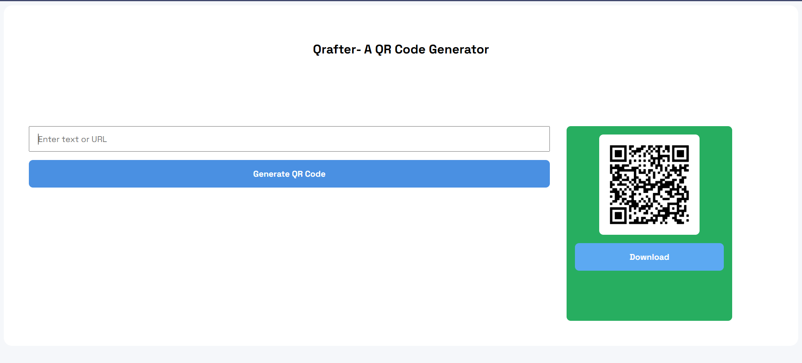

# Qrafter- A QR Code Generator
Qrafter is a lightweight and user-friendly QR code generator that allows you to create customized QR codes quickly and easily. It supports input types such as text, URLs making it convenient for sharing information.




## Uses
### Quick QR Code Generation – Create QR codes for text, URLs, or other information in seconds.

### Sharing Information Easily – Convert links or messages into scannable QR codes for quick sharing.

## Installation/Setup Instructions

Step 1: Clone the repository
```bash
git clone https://github.com/your-username/Qrafter.git
```
Step 2: Navigate into the project folder

```bash
cd Qrafter
```

Step 3: Install required modules

```bash
npm install
```
Step 4: Navigate to Backend folder

```bash
cd Backend
```
Step 5: Run the Server
```bash
node Server.js
```
